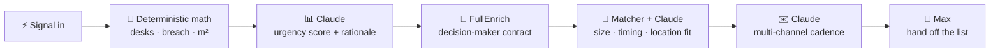

<p align="center">
  
</p>

<h1 align="center">OMO — Off Market Office</h1>

<p align="center"><strong>Hiring data in, square meters out.</strong></p>

<p align="center">An AI agent for Paris commercial real-estate brokers that spots companies about to <em>outgrow</em> their office and companies about to <em>release</em> one, matches them live on a map, and drafts the outreach for both sides — before either company calls a broker.</p>

<p align="center">
  
  
  
  
  
  <br/>
  
  
  
  
  
</p>

---

## 🎯 The problem

Commercial real estate in Paris runs on timing. The best deals are **off-market** — a scale-up about to run out of desks, a company quietly downsizing, a firm in *redressement judiciaire* about to vacate a floor. By the time these hit a broker's inbox, the deal is gone.

The signals that predict them already exist — hiring surges, exec hires, layoffs, insolvency filings — they're just scattered across sources no broker watches in real time.

## 💡 What OMO does

OMO watches two populations of Paris companies on one map and matches them **before either side reaches out**:

|  | 🟣 **Outgrowers** (demand) | 🔴 **Releasers** (supply) |
|---|---|---|
| **Who** | Hiring faster than their office can hold | Shrinking, insolvent, relocating, going remote |
| **Signals** | Hiring surge, new exec hire, job change | Insolvency filing, layoffs, champion exodus, office listing |
| **Agent output** | Months-to-breach, urgency, decision-maker, outreach | Available m², availability date, decision-maker, outreach |

The agent **scores** each company, **enriches** the decision-maker, **matches** compatible pairs, and **drafts** a multi-channel outreach cadence for both — then hands the approved list to an AI sales agent. A match renders as an **animated arc between the two pins** on the map.

> The human stays in the loop the whole way: the agent drafts and recommends; the **broker approves**.

## 🎬 The hero demo (press `S`)

One keystroke fires the full scripted sequence — deterministic, offline-safe, ~12 seconds:

| Step | What happens |
|---|---|
| ⚡ **Signal** | A hiring spike lands on **Cartesia Labs** (11e) |
| 🧠 **Math** | 33 people · 4.5 hires/mo · 40 desks → breach in weeks |
| 📊 **Score** | **Claude** rates urgency **94/100** with a grounded rationale |
| 🔧 **Enrich** | **FullEnrich** waterfall finds the Head of Workplace |
| 🤝 **Match** | Matcher finds **Atelier Numérique** (3e) releasing **520 m²** → **score 91** |
| ✉️ **Draft** | **Claude** writes a multi-channel cadence for both sides |

The map draws a **violet→coral arc** between the two pins, a toast fires, and one click opens the deal.

## 🖼️ A look around

- **Map view** — every Paris company as a pin (violet = needs space, coral = releasing), size ∝ urgency, pulsing when hot. Hover for a mini-card; click for the full deal panel. A live **agent-activity** popup streams the reasoning.
- **Table view** — a sortable "Prospects" grid with side / office-m² / urgency filters, checkboxes to build a **contact list**, and saved lists.
- **Detail panel** — urgency ring, capacity math, signal timeline, FullEnrich contact, ranked matches with Claude rationale, and a **multi-channel cadence** (email · LinkedIn · call) with an A/B subject test, in English or French.

<!-- Add screenshots to docs/ and reference them here, e.g.:  -->

## 🧠 Why this is an agent, not a single call

OMO isn't one retrieve-then-answer prompt. It's a **pipeline of judgment and action** where deterministic code and Claude each do what they're best at:

- **Code owns the numbers** — desk capacity, months-to-breach, needed m², and the size/timing/location match fit are computed in `spacemath.ts` / `matcher.ts`. They're reproducible and never hallucinated.
- **Claude owns judgment & language** — it weighs signals into an urgency score with a rationale, writes the match rationale, and plans the outreach cadence (with an A/B subject choice it reasons about).
- **Adapters own the outside world** — every external service sits behind an interface with a **mock default**, so the demo runs fully offline and any real provider is a drop-in.

## 🔬 How the agent loop works



Signals arrive from the seed, a live `POST /api/simulate/signal`, or the real feeds. Each Claude call streams a one-line summary to the **agent console over Server-Sent Events**, so you literally watch the agent think. Any Claude failure emits an error line and falls back to canned text — the UI never blanks.

## 🌐 Real data & integrations

OMO orchestrates **four real external sources** plus Claude — the app runs offline on synthetic data by default, and each provider goes live when its key is present.

| Source | Role | How it's used |
|---|---|---|
| 🧠 **Claude** (Anthropic, Sonnet 4.6) | Judgment & language | Urgency scoring, match rationale, multi-channel outreach cadence — JSON-mode calls, low temp for scoring, higher for copy |
| 📡 **Sillage** (v2 API) | Demand signals | Live feed of the team's tracked accounts and their hiring / job-change / exec signals |
| 🔔 **BODACC** (OpenDataSoft) | Supply signals | France's **official insolvency registry** — real Paris *procédures collectives* imported onto the map as distressed sellers, each **scored live by Claude** |
| 🔧 **FullEnrich** (v2 waterfall) | Contacts | Finds the decision-maker's email / phone / LinkedIn for a company |
| 🚀 **Max** (Digital Crew, REST v1) | Outreach | "Contact via Max" pushes the approved list to Max's AI sales agent as a **real prospect list**, ready to run a campaign |

> Real companies from BODACC are clearly badged **LIVE · BODACC** (green ring on the map) and kept separate from the synthetic demo set. Contacts are enriched only with consent.

## 🧮 The math (reproducible, in code)

Everything runs on the French office norm of **~10 m² per person**.

```
capacityDesks   = round(officeSqm / 10)
monthsToBreach  = (capacityDesks − headcount) / hiresPerMonth        # null = over capacity
neededSqm       = round(headcount + openRoles × 0.7) × 10            # ~70% of open roles fill
```

The matcher scores a demand↔supply pair on three deterministic axes, then asks Claude for the rationale:

```
sqmFit      = 100 − min(100, |availableSqm − neededSqm| / neededSqm × 100)
timingFit   = 100 if space frees up before the breach window, decays after
locationFit = 100 − 12 × (arrondissement-distance step, haversine-derived), floor 20
score       = 0.45·sqmFit + 0.35·timingFit + 0.20·locationFit
```

## 🧰 Tech stack

| Layer | Technology |
|---|---|
| **Frontend** | React 18 · TypeScript · Vite · Tailwind · `react-leaflet` (CARTO Positron tiles) · `zustand` · `lucide-react` |
| **Backend** | Node 20 · Express · TypeScript · in-memory store → `server/data/db.json` · Server-Sent Events |
| **AI** | Anthropic `@anthropic-ai/sdk` — `claude-sonnet-4-6` (JSON-mode scoring/matching, prose cadences) |
| **Adapters** | `SignalProvider` (Sillage · BODACC · mock) · `EnrichmentProvider` (FullEnrich · mock) · `OutreachProvider` (Max · mock) · LLM (Anthropic) |

## 🚀 Run it locally

```bash
cp .env.example .env       # add ANTHROPIC_API_KEY (see below)
npm install
npm run dev                # server :3001 + client :5173 (Vite proxies /api)
```

Open **http://localhost:5173**.

- `.env` holds secrets and is gitignored. **Only `ANTHROPIC_API_KEY` is needed** for the full agent demo.
- `PROVIDERS=mock` (default) keeps every external call mocked and fully offline-safe. Without an Anthropic key the app still runs — scoring and drafts fall back to deterministic text.
- Enable real providers by adding keys and `PROVIDERS=…,sillage,fullenrich,max`:
  - **Sillage** — `SILLAGE_API_KEY` (auto-detected).
  - **FullEnrich** — `PROVIDERS=fullenrich` + `FULLENRICH_API_KEY` (enriches a *known, consented* contact).
  - **Max** — `PROVIDERS=max` + `DIGITALCREW_API_TOKEN` (a `max_live_` key). Base URL defaults to `https://max.digitalcrew.tech`. Set `MAX_DRAFT_ONLY=1` to build the campaign without auto-sending.
  - **BODACC** — always available, no key.

### 🎛️ Demo controls

| Key / control | Action |
|---|---|
| **`S`** | Fire the hero sequence (auto-switches to the map) |
| **`A`** | Score every company with Claude |
| **`R`** | Reset to the synthetic seed (confirm) |
| 📡 top bar | Live Sillage feed (tracked accounts & signals) |
| 🔔 top bar | Live BODACC insolvencies + "Add to map as sellers" |

## 📁 Project structure

```
off-market-office/
  client/                 React + Vite + Tailwind + Leaflet
    src/components/        MapView · TableView · DetailPanel · MatchArc ·
                          AgentConsole · ContactList · Sillage/Bodacc feeds …
  server/
    src/
      pipeline.ts          ingest → math → score → enrich → match → draft
      matcher.ts           deterministic sqm / timing / location fit
      spacemath.ts         capacity math (desks · breach · needed m²)
      prompts.ts           all Claude prompts
      llm.ts               Anthropic wrapper (JSON-mode helper, SSE events)
      providers/
        signals/           mock · sillage · bodacc
        enrichment/        mock · fullenrich
        outreach/          mock · max
    data/db.json           regenerated by the seed
  .mcp.json                Sillage MCP server config (agent-side)
```

## 🔒 Responsible use

- **All demo companies, people, and contacts are synthetic and fictional.** Real BODACC records (public legal notices) are clearly separated and badged **LIVE**.
- **Human-in-the-loop:** the agent drafts and recommends; the broker approves. Nothing is sent without a connected account and an explicit action.
- Contacts are enriched only with consent; the map footer notes the synthetic data.

## 🏆 Built at the Agentic GTM Hackathon

Station F, Paris — **Anthropic × FullEnrich × Sillage × Digital Crew**. Deterministic math in code, Claude for judgment and language, real external data on both sides of the market.

**OMO — hiring data in, square meters out.**
